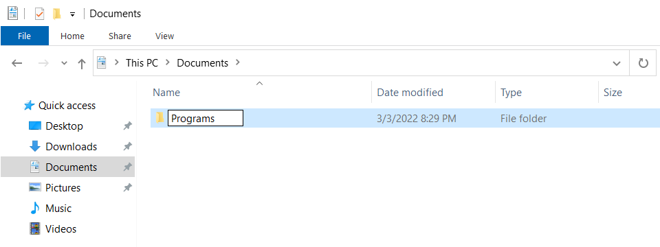
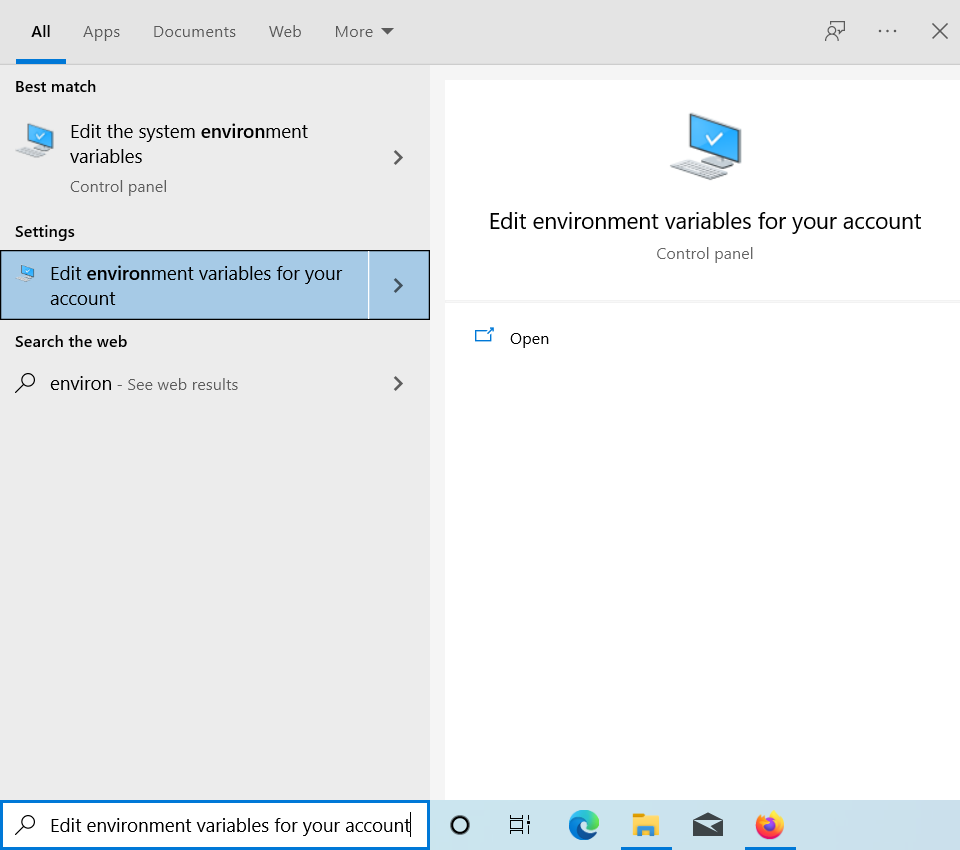
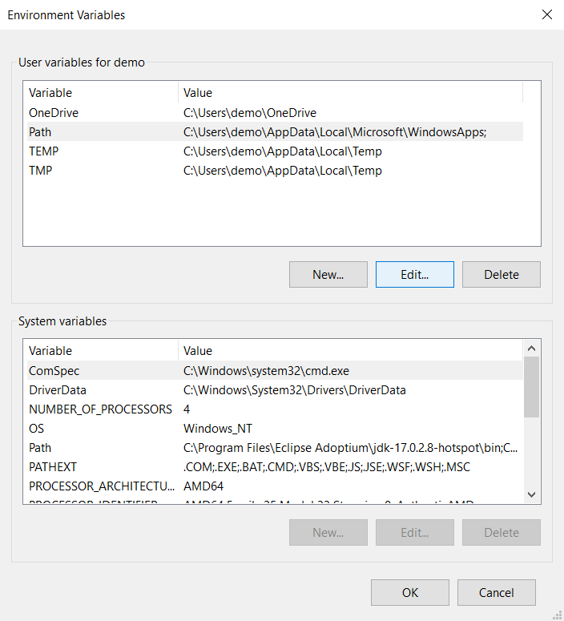
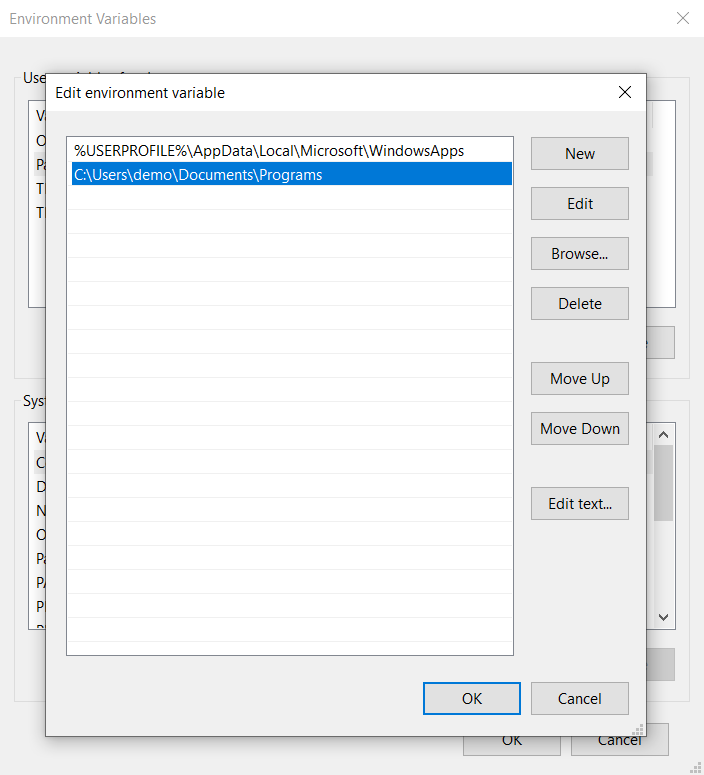
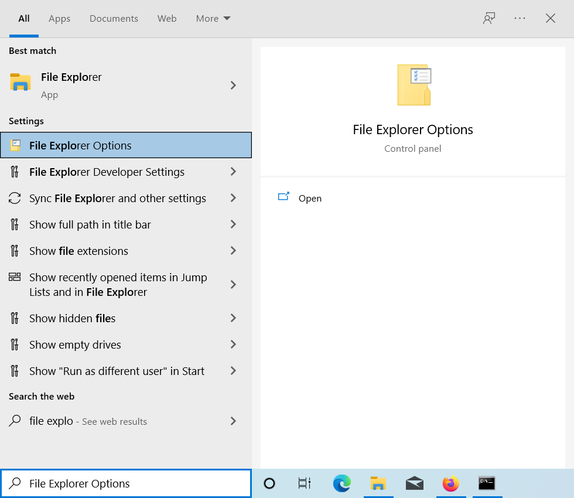
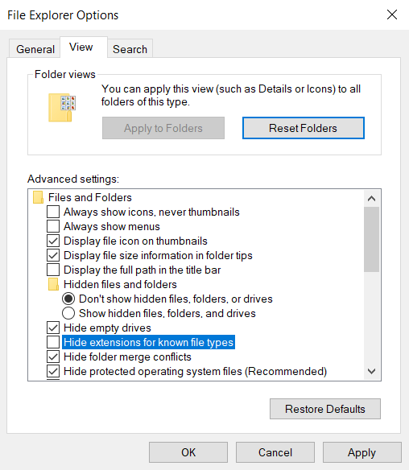
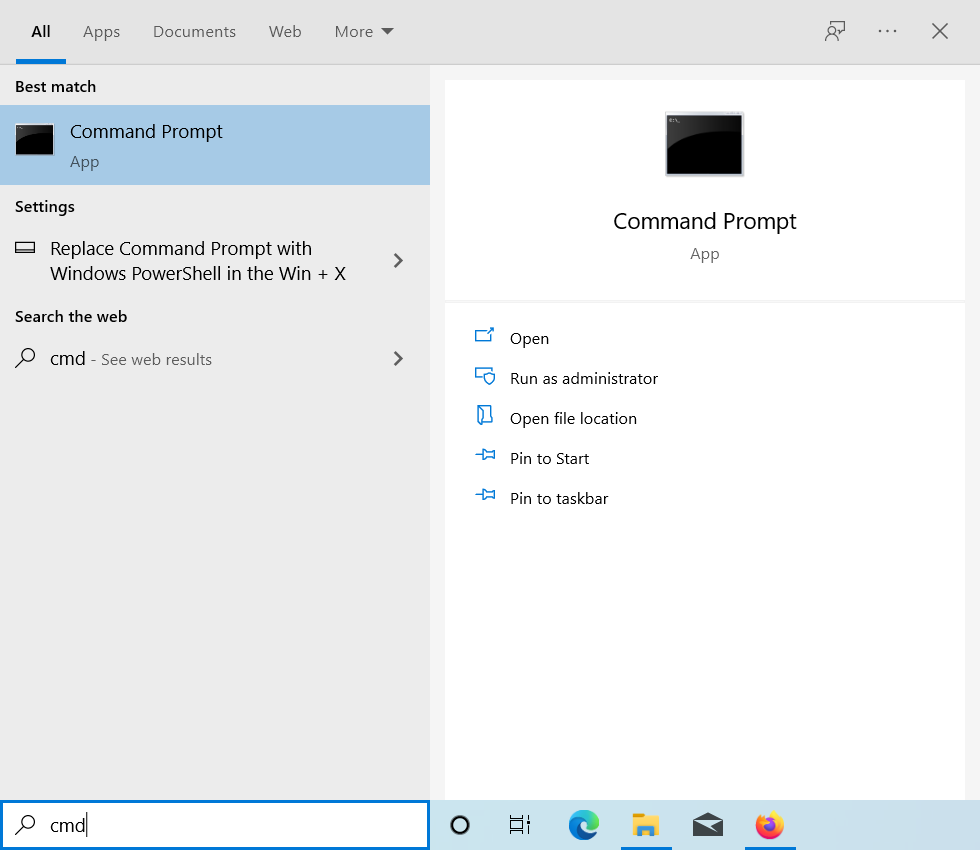

# Windows

## Java

Because Clojure runs on the JVM, we need to first install Java.
There are multiple builds and distributions of Java, however.
I recommended installing the package 'Temurin 17 (LTS)'
from [this page](https://adoptium.net/).
Side note: in software, the acronym 'LTS' refers to a
*long term support* release or version.


## Clojure

Official documentation for installing Clojure on Windows is
[here](https://github.com/clojure/tools.deps.alpha/wiki/clj-on-Windows).

First, you'll want to search Windows and open up a PowerShell console.
PowerShell is a combined command console and programming language
developed by Microsoft for automating tasks on Windows systems.

Running the following command will set a security policy on your system
that allows it to run PowerShell scripts, so long as those scripts
are from a trusted author.
You'll need this set for Clojure on Windows to function correctly.

```
Set-ExecutionPolicy RemoteSigned -Scope CurrentUser
```

Type `y` and enter.

Then run the following, which will download Clojure's installer script and run it:
```
Invoke-Expression (New-Object System.Net.WebClient).DownloadString('https://download.clojure.org/install/win-install-1.10.3.1087.ps1')
```

When prompted for install location, type `1` and enter.

Clojure should now be installed.


## Leiningen

Setting up leinigen will take a bit of technical know-how.

First, we'll want to create a new folder where we can place executable files.
This can be wherever you'd like, but let's say we'll make a folder called
Programs within our Documents folder.



Next, search Windows for 'environ' and you'll find a control panel option
titled 'Edit the environment variables for your account'.




Click on 'Path', then 'Edit...'.

Add a new entry to the dialog, containing the path to the Programs folder we just created.



From step 1 on [the leinigen website](https://leiningen.org), right-click on the link to `lein.bat`,
hit 'Save Link As...', and save it to you the Programs folder you made, making sure to change
the 'Save as type' option to 'All Files'.


Note: Windows will try to save this as a text file by default.
If this happens, make sure you can see file extensions by opening
File Explorer Options, click on the View tab, uncheck
'Hide extensions for known file types', and hit apply.




Then make make sure, renaming if necessary, that the full file name is `lein.bat`
and its type is `Windows Batch File`.


Now, search Windows for 'cmd' and open up the command prompt, and you should be able
to run `lein self-install`.



